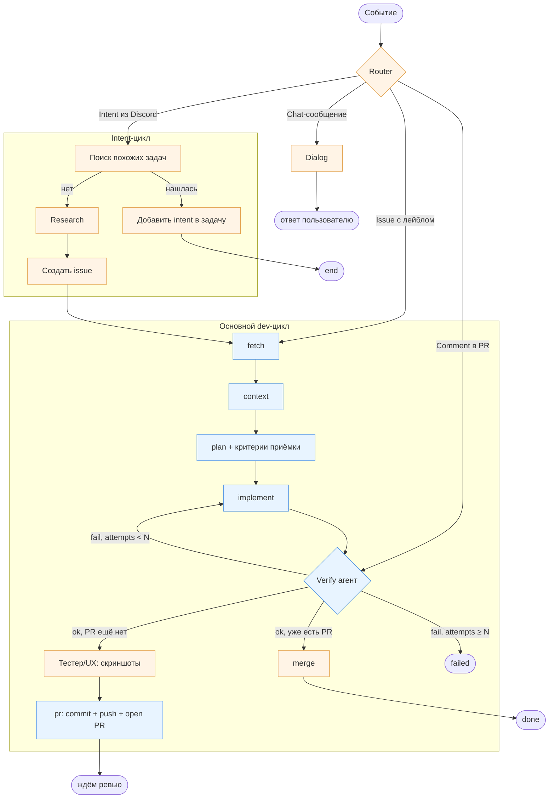

# Future Ideas

Свалка будущих идей и направлений. Записывается «как есть» со слов автора, без додумывания. Со временем пункты могут меняться, уточняться или отпадать.

## Идеи

### Отдельный verification-цикл
Цикл верификации можно будет гонять отдельно. То есть просто агент, который проверяет и пишет комментарий обратно в pull request.

### Отдельный intent-цикл
Можно будет гонять отдельно некий дополнительный intent-цикл.

Например, подключить бота, который слушает Discord. Все сообщения от начальника изначально называются «intent» (что-то вроде пожелания / давления).

Бот проверяет список открытых задач. Если ничего подобного нет — создаёт новую задачу. Но это ещё не задача, это intent. Прежде чем превратиться в задачу, возможно, нужно провести исследование и т.д.

В задачу помещается базовое сообщение от руководителя. Если он ещё что-то напишет об этом — бот идёт по тому же циклу и, например, добавляет новый intent от руководителя в эту же задачу.

### Отслеживание / observability
Очень важно иметь отслеживание. Какой-то динамический экран — может быть в браузере, а может быть и как отдельное приложение.

В нём можно было бы видеть: что начата такая-то задача, работает сейчас такой-то агент, вот был его вход, вот его выход. Может быть даже раскрывающейся вкладочкой показывать его шаги.

В идеале — со стоимостью обработки. Сейчас мы её не собирали (как минимальная версия), но в идеале бы собирать стоимость.

## Открытые вопросы / вызовы

### Flow для стандартного и изменённых режимов
Один из ключевых вызовов — как нужно переделать flow, чтобы он работал и в стандартном режиме (а именно через задачу выполнения верификации), и в изменённых режимах.

Мысли вслух: в теории это может быть не единый воркфлоу, а набор изолированных «если-то» случаев. Если кто-то пишет в комментарии — включается одно действие; если кто-то написал задачу — другое. С одной стороны упрощает, с другой может запутать.

Ещё идея — использовать LangGraph (langraph) для того, чтобы выстраивать цепочку взаимодействий с разными вариантами ответа от разных ребят. Например, в начале какой-то роутер, который идёт либо сюда, либо сюда, и тогда это будет единая цепочка.

### Диалог с агентом
Иногда нужна возможность побеседовать с агентом — например, с ревьюером, чтобы задать ему дополнительные вопросы.

### Деплой
Нужна ещё и возможность деплоить — по возможности.

### Роль тестера / UX
Может быть, завести отдельную роль — что-то вроде тестера или UX. Или, по крайней мере, чтобы он в PR добавлял скриншоты, подтверждающие, что всё работает.

### Генерация «доказательства» на этапе плана
Во время стадии плана генерировать доказательство — то есть что именно должно работать в конце.

### Параллельность
Не очень понятно, как обходиться с параллельностью.

В идеале пока не делать никакой параллельности — чтобы всё работало шаг за шагом, цикл за циклом, для упрощения.

С другой стороны, если это чат — может быть не очень хорошо: например, написали «сделай», а следом сразу написали «не сделай».

Наверное, нужна какая-то компетенция / кнопка «отменить» или «остановить».

### Выбор движка для state-машины
Нужно выбрать: писать свою state-машину (самодельный FSM поверх текущего `pipeline.py`) или использовать LangGraph.

### Динамический план шагов на входе
А что если на входе агент сам будет планировать, по каким шагам идти? Например: «это задача — значит делаем планирование → выполнение → валидацию → деплой». Количество и состав шагов агент придумывает сам под конкретное событие.

## Набросок будущего flow

Попытка уложить всё вышеописанное в один граф: router на входе, основной dev-цикл с retry на verify, отдельный verify-цикл на PR-комменты, intent-цикл из Discord, deploy в конце.

Голубое — что уже есть в `pipeline.py`. Оранжевое — будущее.

Ключевые развилки:
- **Router** на входе: один пайплайн, разные триггеры.
- **Verify** — одна и та же роль, два входа: изнутри цикла (после implement) и снаружи (Router → PR-коммент). Результат зависит от контекста: если PR ещё нет — идём в `TestUX/PR`, если PR уже открыт — в `Merge`; fail ведёт обратно в `implement` до N попыток.
- **Intent → research → issue** — прежде чем стать задачей, проходит ресёрч.
