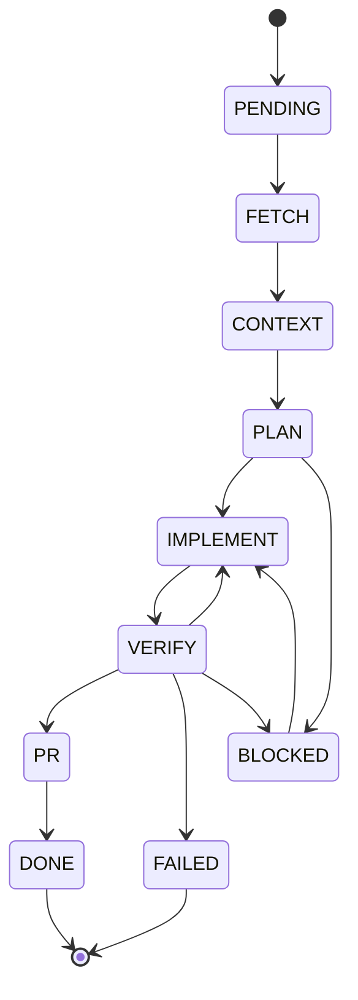

# The Foundry — Architecture Reference

Детальный технический разбор системы оркестрации. Документ структурирован так, чтобы ответить на ключевые вопросы о дизайне пайплайна.

---

## Пошаговый пайплайн

Каждая задача проходит линейный FSM. Стадии хранятся в `tasks.current_stage` (SQLite), поэтому перезапуск процесса не теряет прогресс.

| # | Стадия | Файл | Детерминированность | Что происходит |
|---|--------|------|---------------------|----------------|
| 1 | **FETCH** | `stages/fetch.py` | Детерм. | `gh issue list` по `SOURCE_REPO` + `ISSUE_LABELS`/`ISSUE_ASSIGNEE`/`ISSUE_MILESTONE`/`ISSUE_LIMIT`. Сортировка по `priority/p0`→`p1`. Upsert в SQLite. |
| 2 | **CONTEXT** | `stages/context.py` | Детерм. | Анализирует worktree: языки, манифесты, ключевые слова из issue, релевантные файлы (TF-IDF по ключевым словам), test-команды. Читает `repo_memory` (touched_files, verify_commands, common_failures из предыдущих задач). |
| 3 | **PLAN** | `stages/agent_plan.py` | Недетерм. | Агент генерирует план реализации. Если агент завершает ответ маркером `NEED_VERIFICATION` — workflow блокируется, публикует комментарий в issue (`stages/issue_comment.py`) и ставит статус `BLOCKED`. |
| 4 | **IMPLEMENT** | `stages/agent_implement.py` | Недетерм. | Агент пишет код в worktree. Перед каждой попыткой сохраняется checkpoint (`git diff --binary HEAD → data/checkpoints/task-{id}-attempt-{n}-pre.diff`). При retry — `git reset --hard HEAD` и повтор с feedback предыдущей попытки. |
| 5 | **VERIFY** | `stages/verify.py` | Смешанная | Двухуровневая: ① детерминированные команды (pytest / ruff / cargo test / npm test — `check=False`, короткое замыкание при ненулевом rc); ② LLM-ревьюер на diff (недетерм., только если детерм. прошли). |
| 6 | **PR** | `stages/pr.py` | Детерм. | `git add -A` → `git commit` → `git push -u origin foundry/task-{id}` → `gh pr create`. Закрывает issue комментарием со ссылкой на PR. |
| 7 | **DONE** | `workflows.py` | Детерм. | Worktree удаляется. Запись `repo_memory` (touched_files, verify_commands, common_failures). |

**Retry-цикл** (шаги 4–5): повторяется до `MAX_IMPLEMENT_ATTEMPTS` раз (default: 2). Каждая следующая попытка получает план + резюме предыдущей попытки + отчёт верификатора (`_build_attempt_input` в `workflows.py`).



---

## Как воспроизвести

### Минимальные требования

```bash
brew install uv gh node
gh auth login          # токен с правом repo
```

### Шаги запуска

```bash
# 1. Клонировать репозиторий
git clone https://github.com/your-org/the-foundry && cd the-foundry

# 2. Установить зависимости
uv sync
cd web && npm install && cd ..

# 3. Настроить окружение
cp .env.example .env
# Заполнить SOURCE_REPO, TARGET_REPO (owner/name)
# Опционально: CODING_AGENT=claude_cli, AGENT_MODEL=sonnet

# 4. Создать в SOURCE_REPO label "agent-task" и issue с этим label

# 5. Запустить три процесса в разных терминалах:
uv run foundry run                          # listener (pipeline)
uv run uvicorn api.main:app --reload        # API  → http://localhost:8000
cd web && npm run dev                       # UI   → http://localhost:5173

# Или одной командой:
docker compose up --build
```

### Smoke-тест (оффлайн, без LLM)

```bash
# stub-агент по умолчанию: добавляет строку в README и всегда возвращает PASS
uv run foundry run-issue <номер_issue>
# Ожидаемый результат: PR открыт в TARGET_REPO
```

### Ручные команды

```bash
uv run foundry status              # таблица задач из БД
uv run foundry reset <task_id>     # вернуть задачу в PENDING
uv run foundry run-issue <number>  # запустить одну задачу вручную
uv run foundry pr-feedback         # один проход по review/CI в открытых PR
uv run foundry pr-feedback --once  # то же, синоним
```

---

## Технический стек

- **Агенты**: stub (оффлайн/тесты), claude_cli (Claude Code CLI), codex_cli (OpenAI Codex CLI), opencode_cli (OpenCode — DeepSeek, OpenAI, OpenRouter и др.)
- **LLM**: Anthropic Claude (Haiku / Sonnet / Opus), OpenAI GPT-4o (Codex), DeepSeek, OpenRouter (через opencode)
- **Трекер задач**: GitHub Issues (via `gh` CLI)
- **Языки**: Python 3.11+ (backend + pipeline), TypeScript (frontend)
- **Фреймворки**: FastAPI (HTTP API), Click (CLI), React 19 + Vite (UI), TanStack React Query
- **Среды исполнения**: Python/uv, Node.js 24+, Docker / Docker Compose
- **Observability**: Langfuse (опционально), structlog, SQLite append-only event log

---

## Вопросы и ответы

### Q1: Как агент выбирает следующую задачу?

**Выборка**: `gh issue list --repo SOURCE_REPO --label ISSUE_LABELS --limit ISSUE_LIMIT` — плюс опциональные фильтры `--assignee ISSUE_ASSIGNEE` и `--milestone ISSUE_MILESTONE`. Код: `stages/fetch.py`.

**Приоритизация**: внутри одного прохода задачи с label `priority/p0` идут первыми, `priority/p1` — вторыми. Реализовано в `fetch.py:_sort_by_priority`.

**Очередь**: таблица `tasks` в SQLite. Статус `PENDING` — задача ждёт. При рестарте процесса `RUNNING`-задачи подхватываются снова. Ручной запуск конкретной задачи: `foundry run-issue <number>` (`pipeline.py:run_issue`).

**Plan перед реализацией**: да, стадия `PLAN` обязательна. Агент получает контекст репозитория и описание issue, возвращает текстовый план. Результат сохраняется в `stage_results` и передаётся на `IMPLEMENT`.

**Непонятная задача на этапе плана**: если агент не может составить план (например, задача противоречивая или требует уточнений), он завершает ответ маркером `NEED_VERIFICATION`. Workflow блокируется (`TaskStatus.BLOCKED`), в issue публикуется комментарий с вопросами (`stages/issue_comment.py`). Возобновление: `foundry resume <task_id>` после ответа человека в issue. Код: `workflows.py:_block_for_human`, `workflows.py:normalize_planner_outcome`.

---

### Q2: Как агент решает, что задача завершена?

**Двухуровневая верификация** (`stages/verify.py`):

1. **Детерминированные проверки** — запуск `verify_commands` (auto-detected: ruff + pytest для Python, npm test для JS, cargo test для Rust, go test для Go). Любой ненулевой exit code — короткое замыкание, LLM не вызывается.
2. **LLM-ревьюер** — агент получает `git diff` изменений и возвращает `PASS`, `FAIL: <причина>`, или нечитаемый ответ (→ `UNCLEAR`, требует человека).

**Критерии финального завершения**:
- VERIFY вернул `PASS` (оба уровня)
- `gh pr create` успешен → `task.pr_url` заполнен → `TaskStatus.DONE`

**CI после PR**: `foundry pr-feedback` читает `statusCheckRollup` из GitHub API (`_view_pr_feedback` в `workflows.py`). Если CI упал — агент получает список failing checks и вносит правки на той же ветке.

**Результат верификации через self-review**: агент-ревьюер (тот же backend, что и implementer, но с другим промптом) проверяет diff целиком — без знания о конкретных тестах. Это независимый взгляд на изменения.

---

### Q3: Multi-repo / mono-repo

Система работает с **одним репозиторием за раз** в рамках одной задачи. `SOURCE_REPO` (откуда берутся issues) и `TARGET_REPO` (куда открывается PR) могут быть разными репозиториями — это позволяет разделить «задачник» и «целевой код».

Координация изменений сразу в нескольких репозиториях в одной задаче **не поддерживается**. Worktree создаётся только для `TARGET_REPO`.

---

### Q4: Безопасность и изоляция

**Изоляция на уровне git worktree**: каждая задача исполняется в отдельном `git worktree` (`worktrees/task-{id}`). Основная ветка репозитория недоступна агенту. Код: `worktree.py`.

**Защита от опасных команд** (`security.py:assert_command_allowed`):
- `rm -rf` — запрещён абсолютно
- `git push --force` / `-f` — запрещён
- `git checkout main` / `git switch main` внутри task worktree — запрещён
- `git reset --hard` вне task worktree — запрещён

**Env scrubbing** (`security.py:scrubbed_agent_env`): subprocess агента получает только базовый allowlist (`PATH`, `HOME`, locale и т.п.) + API-ключ конкретного backend'а. Никаких лишних секретов.

**Safe agent mode** (`SAFE_AGENT_MODE=true` по умолчанию): Claude CLI запускается без `--dangerously-skip-permissions`, Codex — без `--dangerously-bypass-approvals-and-sandbox`.

**Защита от sandbox escape** (`stages/pr.py:_sanity_check_changes`): commit отказывает, если агент изменил более 40 файлов или затронул запрещённые пути (`__pycache__`, `.venv/` и т.п.).

**Ветка задачи**: PR всегда открывается из `foundry/task-{id}`, не из `main`.

**Prompt injection через issue**: частичная защита — агент работает в изолированном worktree и не может выполнять команды вне него через foundry-wrapper. Полная защита от инъекций в LLM-промпт не гарантируется и зависит от самого агента (Claude/Codex).

---

### Q5: Обработка обратной связи после PR

**Workflow `pr_feedback`** (`workflows.py:pr_feedback`, `pr_feedback_once`):

1. `foundry pr-feedback` (или фоновый runner) вызывает `gh pr list` — все открытые `foundry/task-*` PR.
2. Для каждого PR запрашивает через `gh pr view --json reviews,comments,statusCheckRollup`.
3. `_format_pr_feedback` формирует feedback-блок из: запрошенных изменений (`CHANGES_REQUESTED`), failing CI checks, последних комментариев.
4. Если feedback не пустой — агент получает промпт «Apply PR feedback» и вносит изменения прямо в ту же ветку (без нового PR).
5. После применения изменений агент пушит на ту же ветку и публикует комментарий в PR: «Applied PR feedback (attempt N)».
6. Завершение: `task.status = DONE` если верификация прошла, иначе ещё одна итерация.

**CI мониторинг**: `statusCheckRollup` из GitHub API парсит conclusion (`FAILURE`, `TIMED_OUT`, `CANCELLED`, `ACTION_REQUIRED`) и передаёт агенту список упавших checks.

**Дедупликация**: перед обработкой сохраняется хэш текущего feedback-блока в `repo_memory` (`pr_feedback_hash:{task_id}`). При следующем запуске, если хэш не изменился — PR пропускается.

---

### Q6: Сбои во время выполнения

**Классификация ошибок** (`workflows.py:normalize_verification`, `pipeline.py:_process_tasks`):

| Тип сбоя | Поведение |
|----------|-----------|
| Pre-implement (FETCH/CONTEXT/PLAN) | Re-queue → `TaskStatus.PENDING` + `Stage.FETCH` |
| Post-implement infra (timeout, exec not found) | `failure_kind=infra`, `retryable=True` → retry implement |
| Детерминированные тесты упали | `failure_kind=deterministic`, `retryable=True` → retry с feedback |
| LLM вернул FAIL | `failure_kind=acceptance`, `retryable=True` → retry с отчётом |
| LLM ответ непонятен | `failure_kind=unclear`, `requires_human=True` → BLOCKED |
| Исчерпаны попытки | `TaskStatus.FAILED` |
| Rate limit / API ошибка агента | Обнаруживается по stderr (`rate`, `429`, `529`) → retry с backoff (до 3 раз, задержка 30/60/120s) |

**Checkpoints**: перед каждой implement-попыткой сохраняется `git diff --binary HEAD` в `data/checkpoints/task-{id}-attempt-{n}-pre.diff`. Полезен для ручного анализа и восстановления.

**Git-конфликты**: не обрабатываются автоматически. Если `git push` упал из-за конфликта, это infra failure → re-queue. В `pr_feedback` ветка пересоздаётся через `git worktree add -B branch origin/branch`.

**Retry**: `MAX_IMPLEMENT_ATTEMPTS=2` по умолчанию. Каждая попытка получает накопленный feedback. Infra-сбои до implement не считаются попытками.

**Состояние пережит рестарт**: SQLite хранит `current_stage` и `status`. При следующем запуске `run_once` подхватит `RUNNING`/`PENDING` задачи и продолжит с последней сохранённой стадии.

---

### Q7: Мониторинг

**Append-only event log** (таблица `task_events`): каждая стадия записывает `stage_started` / `stage_finished` с `duration_ms`, `cost_usd`, `tokens_in`, `tokens_out`. Агентские события (`agent_thinking`, `agent_tool`, `agent_text`, `agent_result`) стримятся в реальном времени. Код: `events.py`.

**Структурированные логи**: `structlog` с полями `task_id`, `stage`, `error`. Формат JSON в проде.

**Langfuse** (опционально, `observability.py`): трассировка всего пайплайна через `@observe` декоратор. Каждая стадия — отдельный span с input/output/cost. Активируется через `LANGFUSE_SECRET_KEY` + `LANGFUSE_PUBLIC_KEY`.

**React UI**: SSE endpoint `/api/tasks/{id}/events` (polling SQLite) стримит события в UI в реальном времени. Dashboard: список задач (статус, стадия), stepper по стадиям, live-лента событий агента.

**API endpoints**: `GET /api/repos/{repo}/memory` — память репозитория. `GET /api/tasks/{id}` — последние 200 событий задачи.

**Восстановление хода агента**: event log содержит все `agent_tool` события (имя инструмента, входные/выходные данные), поэтому полная история действий агента восстанавливаема из БД.

---

### Q8: Долгосрочная память

**Таблица `repo_memory`** (SQLite, `state.py:save_repo_memory / list_repo_memory`): хранит пары `(repo, key, value)`.

Что записывается **после каждой успешной задачи** (`workflows.py:_save_successful_pr_memory`):

| Ключ | Значение | Откуда |
|------|----------|--------|
| `touched_files` | список изменённых файлов | `git status --porcelain` после commit |
| `verify_commands` | обнаруженные test-команды | `context.py:_test_commands` |
| `common_failures` | последние 5 отчётов о неудачных verify | `stage_results` по данной задаче |

**Как используется** (`stages/context.py:run`): при каждом запуске стадии CONTEXT вся память репозитория читается и включается в prompt-контекст для планировщика (`format_for_prompt`). Агент видит: какие файлы обычно меняются, какие команды запускать для тестов, какие ошибки уже встречались.

**API**: `GET /api/repos/{repo}/memory` возвращает все записи памяти для отображения в UI.

---

### Q9: Промежуточное состояние

| Слой | Что хранит | Где |
|------|-----------|-----|
| SQLite `tasks` | статус, стадия, worktree path, branch, pr_url, attempts | `data/foundry.sqlite` |
| SQLite `task_events` | append-only лог всех событий (seq, stage, kind, payload) | то же |
| SQLite `stage_results` | входные/выходные данные каждой стадии, per-attempt | то же |
| SQLite `agent_sessions` | session_id агента для resume (claude_cli) | то же |
| SQLite `repo_memory` | долгосрочная память репозитория | то же |
| git worktree | рабочие файлы задачи в `foundry/task-{id}` ветке | `worktrees/task-{id}/` |
| checkpoints | pre-implement diff каждой попытки | `data/checkpoints/` |
| LLM history | история сообщений хранится в claude session, resumable через `--resume {session_id}` | внутри агента |

Все данные персистентны и переживают рестарт процесса.

---

### Q10: Откат изменений

**Автоматический откат при retry** (`security.py:reset_task_worktree`): перед каждой новой implement-попыткой — `git reset --hard HEAD` внутри task worktree. Это откатывает все незакоммиченные изменения от предыдущей попытки. Разрешено только внутри `worktrees/task-{id}`.

**Checkpoint до попытки**: `security.py:checkpoint_diff` сохраняет `git diff --binary HEAD` в `data/checkpoints/task-{id}-attempt-{n}-pre.diff` перед `git reset`. Diff можно применить вручную: `git apply data/checkpoints/...diff`.

**Failed worktree сохраняется**: при `TaskStatus.FAILED` worktree **не удаляется автоматически** — можно открыть и забрать полезные части diff.

**Защита от потери полезных изменений**: failed worktree на диске + checkpoint diff. Для восстановления: `git apply <checkpoint>` в чистой ветке.

**Успешный worktree**: удаляется автоматически через `worktree.cleanup_worktree` после `DONE`.

---

### Q11: Типы задач и проектов

**Хорошо поддерживается**:
- Bugfix и небольшие feature в одном репозитории
- Проекты с автоматическими тестами (pytest, cargo test, npm test, go test — auto-detection)
- Python, TypeScript/JavaScript, Rust, Go, Java/Kotlin проекты
- Задачи с чётким описанием и acceptance criteria в теле issue
- Проекты с хорошим test coverage (верификатор может опираться на тесты)

**Поддерживается с ограничениями**:
- Рефакторинг (агент работает хорошо, но верификация чисто через тесты может не поймать регрессии)
- Написание тестов (детерминированная верификация прогоняет существующие тесты, но не валидирует качество новых)
- Обновление документации (нет детерминированной верификации для prose)

**Не поддерживается / поддерживается плохо**:
- Задачи, требующие ручного UI-тестирования
- Multi-repo задачи (изменения сразу в frontend и backend разных репо)
- Задачи с deploy-зависимой верификацией (интеграционные тесты в staging)
- Крупные рефакторинги с изменением более 40 файлов (ограничение `MAX_FILES_PER_PR`)

---

### Q12: Непонятная задача

**На стадии PLAN**: если агент не может составить план, он вставляет `NEED_VERIFICATION` в конец ответа. `workflows.py:has_human_input_request` обнаруживает маркер. Workflow вызывает `_block_for_human`:
1. Публикует комментарий в GitHub issue с вопросами агента
2. Ставит `TaskStatus.BLOCKED`
3. Задача ждёт — pipeline её пропускает

**Возобновление**: `foundry resume <task_id>` снимает блокировку → задача возвращается в PENDING → запускается заново с учётом ответа человека в issue (следующий CONTEXT прочитает новые комментарии через обновлённое тело issue).

**На стадии VERIFY**: если агент-ревьюер вернул непонятный ответ (не `PASS` и не `FAIL: ...`) — `failure_kind=unclear`, `requires_human=True` → BLOCKED с тем же механизмом.

**Best effort для размытых задач**: если задача описана плохо, но агент всё равно составил план (`plan_ready`) — система идёт дальше. Верификатор потом поймает несоответствие ожиданиям.

---

### Q13: Обращение к человеку

**Когда и как**:

| Ситуация | Канал | Код |
|----------|-------|-----|
| Агент не понимает задачу (PLAN) | Комментарий в GitHub issue | `stages/issue_comment.py` |
| Верификатор вернул UNCLEAR | Комментарий в GitHub issue | `workflows.py:_block_for_human` |
| Исчерпаны попытки implement | `TaskStatus.FAILED` (нет авто-уведомления, видно в UI/logs) | `pipeline.py` |
| PR создан | GitHub PR (human review) | `stages/pr.py` |
| PR feedback применён | Комментарий в GitHub PR | `workflows.py:pr_feedback` |
| Нужен ручной запуск | CLI `foundry run-issue <n>` | `cli.py` |

**Снятие блокировки**: `foundry resume <task_id>` — ставит `TaskStatus.PENDING`, задача перезапускается.

**Опасные команды**: при `SAFE_AGENT_MODE=true` агент работает в ограниченном режиме и не может выполнять shell-команды без permissions-диалога (Claude) или sandbox (Codex). Foundry wrapper перехватывает опасные shell-вызовы через `security.assert_command_allowed` до их исполнения.
