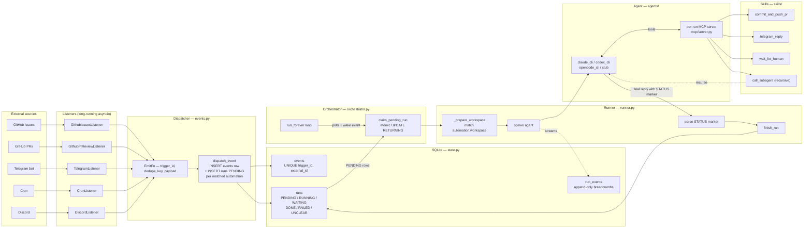
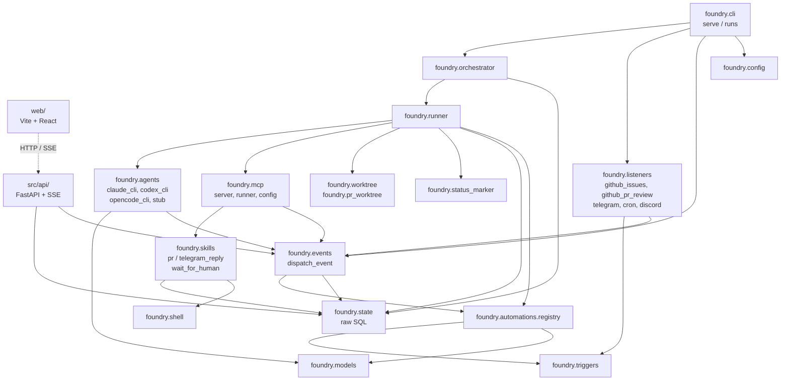
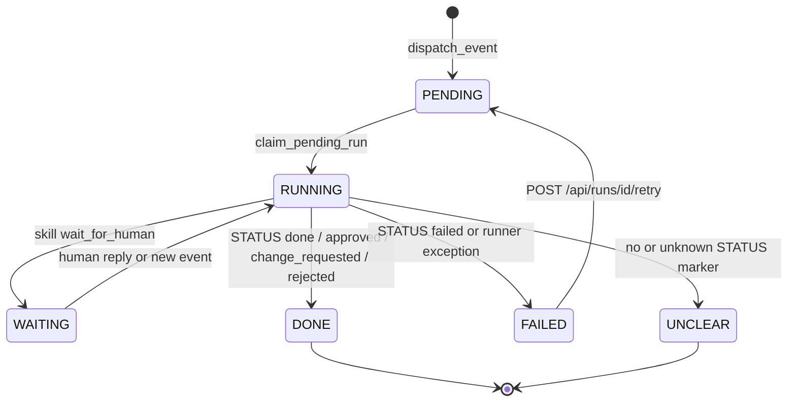

# Foundry — architecture overview

Карта проекта в схемах. Три центральных понятия: **Trigger/Event**,
**Automation**, **Run**. Всё остальное — обвязка вокруг них.

## Поток данных: от внешнего мира до side-effect

Ключевые инварианты:

- **Один write-path в очередь.** `events.dispatch_event` — единственное
  место, где появляется `events` row + `PENDING` runs. И листенеры,
  и API-retry, и `call_subagent` ходят через него.
- **`runs(status='pending')` — это и есть очередь.** Никакого отдельного
  курсора. Восстановление после рестарта = `recover_orphan_runs` (помечает
  висящие `RUNNING` как `FAILED/INFRA`).
- **Run завершается по маркеру в финальной реплике агента**
  (`STATUS: done|approved|change_requested|rejected|failed[:kind]`),
  а не по MCP-инструменту.

## Модули и направление зависимостей

Стрелка `A → B` читается как «A импортирует B». Циклов нет; ядро —
`state` / `events` / `models`, к ним сходятся почти все.

## Жизненный цикл одного run

`outcome` (`approved` / `change_requested` / `rejected`) — это смысловой
вердикт `pr_review`, лежит рядом со статусом `DONE`; жизненный цикл
успешный.

## Workspace-дискриминатор

`Automation.workspace: Literal["git_worktree", "pr_worktree", "fixed", "ephemeral"]`
определяет, в каком каталоге запустится агент. Раздаётся в
[`runner._prepare_workspace`](../../src/foundry/runner.py) одним
`match`-ом:

| Значение | Где живёт | Кто использует | Зачем |
|---|---|---|---|
| `git_worktree` | `WORKTREE_ROOT/task-<run_id>` на ветке `foundry/task-<run_id>` | `dev_task` | Изоляция веток для PR. |
| `pr_worktree` | под `pr_review_base_path` на `head_sha`, rsync-овый overlay для untracked-конфигов | `pr_review` | Воспроизвести состояние PR локально. |
| `fixed` | `cwd` из реестра | `tg_chat` | Claude CLI индексирует `--resume` сессии по хешу cwd — нужен стабильный путь. |
| `ephemeral` | `WORKTREE_ROOT/run-<run_id>/` | cron / utility | Просто нужен writable tmpdir. |

## Дальше

- [extending.md](extending.md) — как добавить новый listener или
  automation шаг за шагом.
- [agent-protocol.md](agent-protocol.md) — исторический документ про
  staged-pipeline (≤ C2). Текущий контракт агента — в
  [src/foundry/agents/CLAUDE.md](../../src/foundry/agents/CLAUDE.md).
- [simplify-2026-05.md](simplify-2026-05.md) — журнал последней
  упрощающей итерации (убран `AgentStage`, схлопнут `workspace`,
  выделен `runner.py`).
